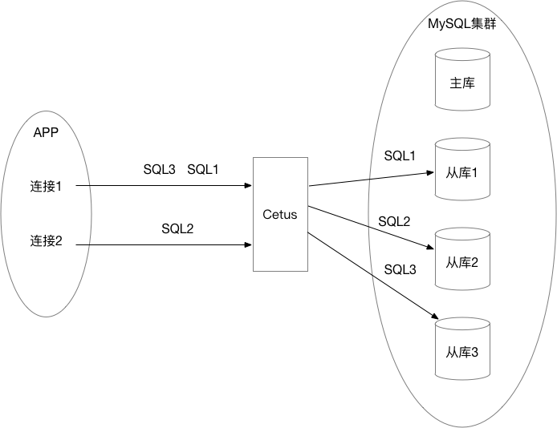
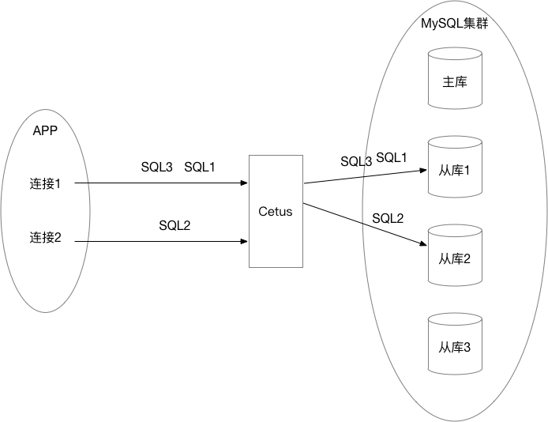

## Cetus路由策略介绍

### 1 概述
Cetus会对客户端发送过来的SQL进行分类，通常DDL/DML/事务等类型的SQL划分为**写请求**，DQL类的SQL划分为**读请求**。通常写请求会发往主库，而读请求会根据不同的策略有选择的发往从库或是主库。

本文重点讨论读请求的路由策略，即读请求如何分配到后端同一个MySQL集群内的各个DB。cetus的读请求的路由策略主要分两部分：1 主库和从库之间读请求的策略； 2 从库之间的读请求的策略。

### 2 主库和从库之间读请求的策略

默认情况下，非事务中、未通过注释强制路由主库或未使用锁的读请求会优先路由到从库，各个从库之间负载均衡。只有当从库都不可用时，读请求才会路由到主库。

有些业务场景下，主库可以分担部分读请求，这时就涉及到读请求在主库和从库上配置负载策略了。Cetus中，可以通过配置参数`read-master-percentage`来指定默认的读请求路由到主库的百分比，该参数的取值范围是[0, 100]。该值默认为0，即所有读请求会优先路由从库，所有从库均不可用时，才会路由主库；如果该参数设置为100时，则所有读请求都会路由到主库；如果该值设置为(0, 100)时，则会按照设置的比例进行路由。需要注意的是，该值表示的是主库和**所有从库**的比例。

### 3 从库之间的读请求的策略

路由到从库的请求，会在各个从库之间进行负载均衡。目前Cetus各个从库之间的读请求负载策略仅支持轮询（RR）方式。

在请求分配方面，Cetus也进行了优化。一些MySQL数据库中间件是基于SQL的维度做负载均衡的，即不会考虑SQL是否是同一个连接还是不同连接发送来的，中间件依次将接收到的SQL按照策略发往后端的数据库。

在实际使用中发现，长连接的场景下，该策略会造成大量的连接切换，从而造成session级变量的频繁调整，影响SQL执行效率。因此，Cetus对其进行了优化，并非完全按照SQL的维度做负载均衡。Cetus考虑了同一个连接连续发送SQL请求的情况，不会立即将当前SQL使用完的Cetus与MySQL的连接放回连接池复用，而是持有短暂（256毫秒）时间，以期后续仍有SQL执行，从而避免了session级变量的调整，大大增加了SQL执行的效率。

### 4 读请求的路由策略总结

在存在至少1个**可用从库**的情况下，影响**读请求**的路由策略的因素主要有：

- 1 事务中的查询 
- 2 `select...for update` 或 `select ... lock in share mode`  
- 3 Cetus设置参数`master-preferred=true`所有流量默认全部路由主库 
- 4 Cetus设置参数`read-master-percentage`控制主从读流量负载 
- 5 使用注释`/*#mode=READWRITE*/`或`/*#mode=READONLY*/`

默认情况下，读请求会优先路由到从库，从库之间按照**轮询策略**在各个从库之间做负载均衡；一旦所有从库均不可用，会路由到主库上。目前Cetus的各个从库暂不支持按照权重做负载。

对于第1、2、3点，Cetus会将查询语句直接路由主库。

对于第4点，如果设置`read-master-percentage=100`，所有的读请求均路由到主库；如果设置`read-master-percentage=[0, 100)`，Cetus会将读请求按照该比例路由到主库和从库。注意，这里的从库指的是全部的从库，即该比例指的是主库和**全部从库**的比例。

对于第5点，如果使用注释`/*#mode=READWRITE*/`，读请求会路由到主库；如果使用注释`/*#mode=READONLY*/`读请求会路由从库，如果所有从库均不可用时才会**路由到主库**。

以上各因素的优先级，注释的优先级最高，其次是参数`master-preferred`，最后是参数`read-master-percentage`。